# BluePrints en Tiempo Real — Lab P4 (Sockets & STOMP)

**Escuela Colombiana de Ingeniería Julio Garavito · Arquitecturas de Software (ARSW)**

Aplicación de dibujo colaborativo de planos. Una SPA en React + Vite consume la API CRUD de
BluePrints (Spring Boot, JWT, PostgreSQL) y replica en vivo cada punto dibujado entre todas las
pestañas que tienen abierto el mismo plano.

> **Se implementaron las dos tecnologías de tiempo real.** El enunciado pide elegir una entre
> Socket.IO y STOMP; este proyecto incluye **ambas** —**STOMP** sobre Spring WebSocket y
> **Socket.IO** sobre Node— y se cambia de una a otra **desde la interfaz**, con el selector
> *None / STOMP / Socket.IO*, sin recargar la página ni reiniciar nada. El código y el
> funcionamiento de cada una están en la [sección 5](#5-tiempo-real).

| Integrante                                                 | Rol        |
|------------------------------------------------------------|------------|
| [Juan David Valero Abril](https://github.com/Valero25)     | Estudiante |
| [Juan Esteban Sanchez Garcia](https://github.com/juanesgl) | Estudiante |

| Recurso | Enlace |
|---|---|
| **Video de demostración** (colaboración en vivo y CRUD) | **<https://youtu.be/-SgkN_35QZ0>** |
| **Cómo ejecutar** (paso a paso, Linux y Windows, troubleshooting) | **[COMO_EJECUTAR.md](./COMO_EJECUTAR.md)** |
| Documentación interactiva del API (con el back arriba) | <http://localhost:8080/swagger-ui.html> |

---

## Contenido

1. [Alcance y cumplimiento del enunciado](#1-alcance-y-cumplimiento-del-enunciado)
2. [Arquitectura](#2-arquitectura)
3. [Puesta en marcha](#3-puesta-en-marcha)
4. [API REST](#4-api-rest)
5. [Tiempo real](#5-tiempo-real)
6. [Seguridad](#6-seguridad)
7. [Observabilidad y estabilidad](#7-observabilidad-y-estabilidad)
8. [Análisis: Socket.IO vs STOMP](#8-análisis-socketio-vs-stomp)
9. [Pruebas](#9-pruebas)
10. [Evidencias](#10-evidencias)
11. [Documentos relacionados](#11-documentos-relacionados)

---

## 1. Alcance y cumplimiento del enunciado

### Criterios funcionales

| Lo que pide el enunciado | Cómo se resolvió | Dónde verlo |
|---|---|---|
| **CRUD (REST):** los cinco endpoints `GET ?author=`, `GET /:author/:name`, `POST`, `PUT`, `DELETE` | Implementados en `BlueprintsAPIController` con las mismas rutas, protegidos con JWT | [API REST](#4-api-rest) |
| **Tiempo real, elegir uno:** Socket.IO (`join-room`, `draw-event` → `blueprint-update`) **o** STOMP (`@MessageMapping("/draw")` → `/topic/blueprints.{author}.{name}`) | **Se hicieron los dos**, con los eventos, destinos y nombres de sala del enunciado | [STOMP](#53-stomp-spring-websocket) y [Socket.IO](#54-socketio-node) |
| **UI:** lienzo con dibujo por clic (incremental) | `BlueprintCanvas.jsx` pinta los puntos del plano actual desde Redux; cada clic agrega un punto y repinta | [Evidencias](#10-evidencias) |
| **UI:** panel del autor con tabla de planos y **total de puntos** (`reduce`) | Selector memoizado `selectTotalPoints`: un `reduce` sobre los planos del autor | [API REST](#4-api-rest) |
| **UI:** barra de acciones Create / Save-Update / Delete | Thunks de Redux Toolkit sobre Axios; guardar es un `PUT` de reemplazo | [Evidencias](#10-evidencias) (CRUD) |
| **UI:** selector de tecnología **None / Socket.IO / STOMP** | Selector en la tarjeta *Tecnología de tiempo real*; cambia de transporte en caliente | [Selector de tecnología](#52-selector-de-tecnología) |
| **Convención:** plano como canal/sala `blueprints.{author}.{name}` | Es el nombre del tópico STOMP y de la sala Socket.IO | [Contrato](#51-contrato) |
| **Variables de entorno:** `VITE_API_BASE`, `VITE_IO_BASE`, `VITE_STOMP_BASE` | Las tres están soportadas con los valores del enunciado | [Puesta en marcha](#3-puesta-en-marcha) |
| **DX/Calidad:** código limpio, manejo de errores, README de equipo | Interfaz común de transporte, badge de estado y mensajes de error, este documento | [Diseño del cliente](#55-diseño-del-cliente), [Observabilidad](#7-observabilidad-y-estabilidad) |
| **Seguridad (mínimos):** validación de payloads y restricción de orígenes; JWT opcional | Validación en ambos servidores (**zod** en Node), orígenes restringidos y JWT en todo el CRUD | [Seguridad](#6-seguridad) |

### Entregables

| Entregable | Estado |
|---|---|
| Código del front integrado con CRUD y tiempo real | Carpeta `front/`, con los dos transportes |
| Video corto mostrando colaboración en vivo y operaciones CRUD | <https://youtu.be/-SgkN_35QZ0> |
| README del equipo: setup, endpoints usados, decisiones (rooms/tópicos) | [Puesta en marcha](#3-puesta-en-marcha), [API REST](#4-api-rest) y [Decisiones de diseño](#56-decisiones-de-diseño) |
| Comparativa Socket.IO vs STOMP (opcional) | [Análisis](#8-análisis-socketio-vs-stomp) |

### Rúbrica

| Criterio | Qué pide | Dónde se cubre |
|---|---|---|
| **Funcionalidad (40 %)** | Tiempo real estable (join/broadcast), aislamiento por plano, CRUD operativo | [Tiempo real](#5-tiempo-real), [Evidencias](#10-evidencias) y [video](https://youtu.be/-SgkN_35QZ0) |
| **Calidad técnica (30 %)** | Estructura limpia, manejo de errores, documentación clara | [Arquitectura](#2-arquitectura), [Diseño del cliente](#55-diseño-del-cliente), [Pruebas](#9-pruebas) |
| **Observabilidad/DX (15 %)** | Logs útiles (conexión, eventos), health checks básicos | [Observabilidad](#7-observabilidad-y-estabilidad) |
| **Análisis (15 %)** | Hallazgos de latencia y reconexión; pros y contras Socket.IO vs STOMP | [Análisis](#8-análisis-socketio-vs-stomp) y reconexión en [Observabilidad](#7-observabilidad-y-estabilidad) |

### Casos de prueba

Casos de prueba mínimos del enunciado, verificados con ambos transportes:

- [x] **Estado inicial:** al abrir un plano el lienzo carga sus puntos desde el API.
- [x] **Dibujo local:** un clic agrega el punto y redibuja.
- [x] **Tiempo real multi-pestaña:** el punto de una pestaña aparece en la otra, sin duplicarse en
  el emisor.
- [x] **CRUD:** Create / Save / Delete refrescan la tabla y el **Total** del autor.

Casos adicionales que también se comprobaron:

- [x] **Aislamiento:** una pestaña en otro plano no recibe nada.
- [x] Guardar desde las dos pestañas no duplica puntos en la base de datos.
- [x] Cambiar de plano en la misma pestaña cambia de tópico/sala y el badge sigue en `connected`.
- [x] Con **None** no hay replicación.

---

## 2. Arquitectura

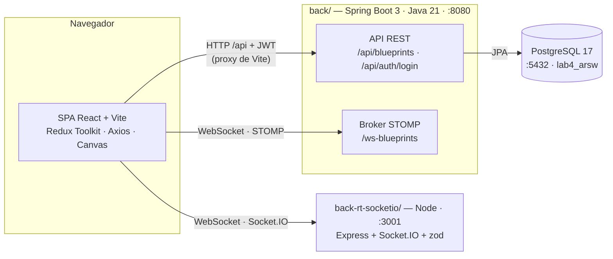

- El **CRUD y el estado inicial** del lienzo siempre salen de la API REST; los canales de tiempo
  real solo retransmiten puntos entre pestañas.
- Los WebSocket **no pasan por el proxy de Vite**: el navegador se conecta directo al puerto 8080
  (STOMP) o 3001 (Socket.IO).
- El servidor Socket.IO no tiene estado ni acceso a la base de datos.

### Estructura del repositorio

```
Lab6_ARSW/
├─ front/                    SPA React + Vite
│  ├─ src/components/        BlueprintCanvas, BlueprintForm, BlueprintList…
│  ├─ src/features/          Slices de Redux: auth, blueprints, realtime
│  ├─ src/hooks/             useRealtime: conecta, entra al plano y limpia al desmontar
│  ├─ src/services/          apiClient (Axios + JWT), apimock, stompService, socketService
│  └─ tests/                 Vitest + Testing Library
├─ back/                     API REST + STOMP (Spring Boot 3.3 / Java 21)
│  ├─ src/main/java/…/controllers/   BlueprintsAPIController (CRUD)
│  ├─ src/main/java/…/realtime/      Controlador STOMP, logger de sesiones, manejo de errores
│  ├─ src/main/java/…/security/      JWT (RSA), scopes, CORS
│  ├─ compose.yaml · init.sql        PostgreSQL y datos de ejemplo
│  └─ src/test/                      Pruebas del controlador de tiempo real
├─ back-rt-socketio/         Servidor Socket.IO (Node, Express, zod)
├─ docs/img/                 Evidencias
├─ COMO_EJECUTAR.md          Guía operativa y troubleshooting
└─ README.md                 Este documento
```

### Tecnologías

| Capa | Tecnologías |
|---|---|
| Front | React 18, Vite 7, Redux Toolkit 2, React Router 6, Axios, `@stomp/stompjs` 7, `socket.io-client` 4, Vitest 3 |
| Back | Java 21, Spring Boot 3.3.2 (Web, WebSocket, Security, OAuth2 Resource Server, Data JPA, Actuator), springdoc-openapi |
| Tiempo real alterno | Node 18+, Express 5, Socket.IO 4, zod 4 |
| Datos | PostgreSQL 17 |

---

## 3. Puesta en marcha

Requisitos: Java 21, Maven 3.9+, Node 18+ y Docker (solo para PostgreSQL).

La guía completa, con los comandos para **Linux/macOS y Windows**, las comprobaciones de cada paso
y la solución de problemas, está en **[COMO_EJECUTAR.md](./COMO_EJECUTAR.md)**. En resumen son
cuatro terminales:

| # | Carpeta | Comando | Queda en |
|---|---|---|---|
| 1 | `back/` | `docker compose up -d` | PostgreSQL en `localhost:5432`, con las tablas y dos planos de ejemplo del autor `juan` |
| 2 | `back/` | `mvn spring-boot:run` | API REST + STOMP en `http://localhost:8080` |
| 3 | `back-rt-socketio/` | `npm install` y luego `npm start` | Socket.IO en `http://localhost:3001` |
| 4 | `front/` | `npm install` y luego `npm run dev` | Aplicación en `http://localhost:5173` |

Usuarios de prueba: `student / student123` y `assistant / assistant123`.

### Variables de entorno del front

Se definen en `front/.env.local`, que se crea copiando [`front/.env.example`](./front/.env.example).
Sin el archivo se usan los valores por defecto.

| Variable            | Valor por defecto        | Uso |
|---------------------|--------------------------|-----|
| `VITE_API_BASE_URL` | `/api`                   | Base del API REST. Relativa: pasa por el proxy de Vite. |
| `VITE_API_BASE`     | —                        | Alternativa con el nombre del enunciado: solo el host (`http://localhost:8080`); el front agrega `/api`. |
| `VITE_STOMP_BASE`   | `http://localhost:8080`  | Host del back STOMP. El front agrega `/ws-blueprints` y cambia el esquema a `ws`. |
| `VITE_IO_BASE`      | `http://localhost:3001`  | Servidor Socket.IO. |
| `VITE_USE_MOCK`     | `false`                  | `true` usa datos en memoria, sin backend. |

Variables de los servidores: `SPRING_DATASOURCE_URL` y `blueprints.realtime.allowed-origins` en el
back; `PORT` y `ALLOWED_ORIGINS` en el servidor Socket.IO.

### Recorrido de la demostración

1. Inicia sesión y entra a **Tiempo real** (`/p4`).
2. Escribe `juan`, pulsa **Get blueprints** y abre `plano-1` con **Open**.
3. En **Tecnología de tiempo real** elige **STOMP** o **Socket.IO**: el badge pasa a `connected`.
4. Repite en una segunda pestaña y haz clic en el lienzo de cualquiera: el punto aparece en la otra.
5. Abre `casa-de-campo` en una tercera pestaña: no recibe nada (aislamiento por plano).

---

## 4. API REST

Todos los endpoints exigen JWT con el scope `blueprints.read` (lectura) o `blueprints.write`
(escritura), salvo el login, el health check y la documentación.

| Método   | Ruta                                      | Descripción                                    | Respuesta   |
|----------|-------------------------------------------|------------------------------------------------|-------------|
| `POST`   | `/api/auth/login`                         | Emite el token JWT                             | `200`/`401` |
| `GET`    | `/api/blueprints`                         | Todos los planos                               | `200`       |
| `GET`    | `/api/blueprints?author={author}`         | Planos de un autor (forma del enunciado)       | `200`/`404` |
| `GET`    | `/api/blueprints/{author}`                | Planos de un autor                             | `200`/`404` |
| `GET`    | `/api/blueprints/{author}/{name}`         | Puntos de un plano (estado inicial del lienzo) | `200`/`404` |
| `POST`   | `/api/blueprints`                         | Crear un plano                                 | `201`/`403` |
| `PUT`    | `/api/blueprints/{author}/{name}`         | Reemplazar todos los puntos (**Guardar**)      | `204`/`404` |
| `PUT`    | `/api/blueprints/{author}/{name}/points`  | Agregar un punto                               | `202`/`404` |
| `DELETE` | `/api/blueprints/{author}/{name}`         | Eliminar un plano                              | `204`/`404` |
| `GET`    | `/actuator/health`                        | Health check                                   | `200`       |

El **total de puntos por autor** no lo calcula el servidor: el front lo obtiene con el selector
memoizado `selectTotalPoints` (un `reduce` sobre los planos del autor) y se refresca tras Create,
Save y Delete.

---

## 5. Tiempo real

### 5.1 Contrato

El plano es el canal lógico: **`blueprints.{author}.{name}`**. El payload es el mismo en ambos
transportes:

```json
{ "author": "juan", "name": "plano-1", "point": { "x": 120, "y": 240 }, "clientId": "…" }
```

|                     | STOMP (Spring)                                | Socket.IO (Node)                                   |
|---------------------|-----------------------------------------------|----------------------------------------------------|
| Conexión            | `ws://localhost:8080/ws-blueprints`           | `http://localhost:3001` (`transports: ['websocket']`) |
| Entrar al plano     | `subscribe /topic/blueprints.{author}.{name}` | `emit('join-room', 'blueprints.{author}.{name}')`  |
| Publicar un punto   | `publish /app/draw`                           | `emit('draw-event', payload)`                      |
| Recibir             | mensaje del tópico                            | `on('blueprint-update')`                           |
| Mensaje rechazado   | Se registra en el servidor y se descarta      | `emit('rt-error', { event, error })` al emisor     |
| Eco al emisor       | Sí (el broker reenvía a todo el tópico)       | No (`socket.to(room)` excluye al emisor)           |
| Health check        | `GET /actuator/health`                        | `GET /health` (clientes y salas activas)           |

Flujo de un punto, de la pestaña A a la pestaña B:

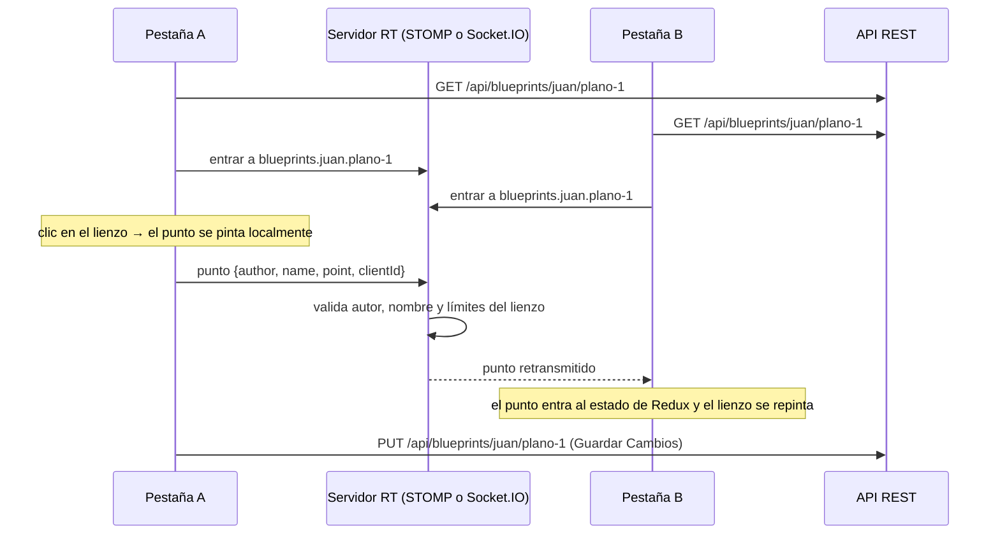

### 5.2 Selector de tecnología

El enunciado permite elegir un solo transporte. Aquí están los dos y la elección se hace **en
tiempo de ejecución**, en la tarjeta *Tecnología de tiempo real* de la pestaña **Tiempo real**
(`/p4`):

| Opción | Qué hace |
|---|---|
| **None** | Sin tiempo real: los puntos solo existen en la pestaña que los dibuja |
| **STOMP** | Se conecta a `ws://localhost:8080/ws-blueprints` (el mismo back de Spring) |
| **Socket.IO** | Se conecta a `http://localhost:3001` (servidor Node de `back-rt-socketio/`) |

Las opciones del selector y la fábrica que crea el cliente salen del mismo archivo, de modo que
cada tecnología es una entrada de un mapa (`front/src/features/realtime/realtimeClients.js`):

```js
export const RT_TECHNOLOGIES = [
  { value: 'none', label: 'None' },
  { value: 'stomp', label: 'STOMP' },
  { value: 'socketio', label: 'Socket.IO' },
]

const FACTORIES = {
  stomp: createStompClient,
  socketio: createSocketClient,
}

export function createRealtimeClient(tech, handlers) {
  const factory = FACTORIES[tech]
  return factory ? factory(handlers) : null   // 'none' no crea cliente
}
```

El `<select>` de `BlueprintsPage.jsx` guarda la elección en Redux (`techSelected`), y el hook
`useRealtime.js` reacciona al cambio (extracto):

```js
useEffect(() => {
  if (!enabled) return undefined            // None, o no hay plano abierto

  const client = createRealtimeClient(tech, {
    onStatus: (status) => dispatch(statusChanged(status)),           // alimenta el badge
    onUpdate: (payload) => {
      if (payload.clientId === CLIENT_ID) return                     // eco propio: se ignora
      dispatch(addRemotePointToCurrent({ author, name, point: payload.point, clientId: payload.clientId }))
    },
  })
  client.connect({ author, name })

  return () => client.disconnect()          // al cambiar de tecnología o de plano
}, [tech, author, name, enabled, dispatch])
```

**Qué ocurre al cambiar el selector:** React ejecuta la limpieza del efecto, que desconecta el
cliente anterior, y lo vuelve a correr con la nueva tecnología: crea el otro cliente, se conecta y
entra al mismo plano. El badge vuelve a `connected` en cuanto el nuevo cliente termina de
conectarse. El lienzo y los puntos sin guardar no se pierden, porque viven en Redux y no en el
cliente de tiempo real.

Al dibujar, la página hace lo mismo sea cual sea el transporte (`BlueprintsPage.jsx`):

```jsx
<BlueprintCanvas
  points={current?.points || []}
  onAddPoint={(p) => {
    dispatch(addPointToCurrent(p))   // 1. se pinta en esta pestaña
    broadcast(p)                     // 2. se envía por el transporte elegido
  }}
/>
```

Para que dos pestañas colaboren deben tener **la misma tecnología seleccionada**: los dos canales
son independientes y un punto enviado por STOMP no llega a quien está en Socket.IO.

### 5.3 STOMP (Spring WebSocket)

**Funcionamiento.** El broker vive dentro del mismo back de Spring. Cada pestaña se suscribe al
tópico de su plano y publica sus puntos en `/app/draw`; el controlador los valida y los reenvía al
tópico, y el broker los entrega a todos los suscriptores, incluido el emisor.

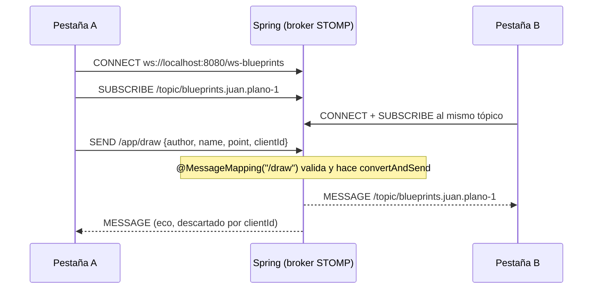

**Servidor — configuración del broker** (`back/…/config/WebSocketConfig.java`):

```java
@Configuration
@EnableWebSocketMessageBroker
public class WebSocketConfig implements WebSocketMessageBrokerConfigurer {

    @Override
    public void configureMessageBroker(MessageBrokerRegistry registry) {
        registry.enableSimpleBroker("/topic");               // destinos de salida
        registry.setApplicationDestinationPrefixes("/app");  // destinos hacia @MessageMapping
    }

    @Override
    public void registerStompEndpoints(StompEndpointRegistry registry) {
        registry.addEndpoint("/ws-blueprints").setAllowedOrigins(allowedOrigins);
    }
}
```

**Servidor — recibir y retransmitir** (`back/…/realtime/BlueprintRealtimeController.java`,
extracto):

```java
@MessageMapping("/draw")
public void draw(@Payload DrawEvent event) throws IOException {
    String author = sanitize(event.author());   // [A-Za-z0-9._- ]{1,64}
    String name = sanitize(event.name());
    if (author.isEmpty() || name.isEmpty()) {
        throw new IllegalArgumentException("author and name are required…");
    }

    Point point = MAPPER.convertValue(event.point(), Point.class);
    if (point.getX() < 0 || point.getX() > CANVAS_WIDTH
            || point.getY() < 0 || point.getY() > CANVAS_HEIGHT) {
        throw new IllegalArgumentException("point out of canvas bounds…");
    }

    messaging.convertAndSend(topicFor(author, name),          // /topic/blueprints.{author}.{name}
            new DrawEvent(author, name, point, sanitizeClientId(event.clientId())));
    log.info("draw point ({},{}) on blueprint {}/{}", point.getX(), point.getY(), author, name);
}
```

Un mensaje inválido lanza `IllegalArgumentException`; `RealtimeExceptionHandler` lo registra con su
motivo y no se retransmite.

**Cliente** (`front/src/services/stompService.js`, extracto):

```js
const client = new Client({
  brokerURL: toBrokerURL(import.meta.env.VITE_STOMP_BASE),   // http://host → ws://host/ws-blueprints
  reconnectDelay: 3000,
  heartbeatIncoming: 10000,
  heartbeatOutgoing: 10000,
})

// Suscribir en onConnect: un subscribe() antes del handshake se descarta en silencio.
client.onConnect = () => {
  subscription = client.subscribe(`/topic/blueprints.${room.author}.${room.name}`, (message) => {
    const payload = JSON.parse(message.body)
    if (payload?.point) onUpdate?.(payload)
  })
  onStatus?.({ state: 'connected' })
}

// Publicar un punto
client.publish({
  destination: '/app/draw',
  body: JSON.stringify({ author, name, point, clientId }),
})
```

Como `onConnect` se ejecuta en cada conexión, tras una caída el cliente se re-suscribe solo.

### 5.4 Socket.IO (Node)

**Funcionamiento.** Es un servidor aparte (`back-rt-socketio/`, puerto 3001) que solo retransmite
puntos: no guarda nada ni accede a la base de datos. Cada pestaña entra a la sala de su plano con
`join-room` y envía sus puntos con `draw-event`; el servidor los valida y los emite como
`blueprint-update` al resto de la sala, sin eco al emisor.

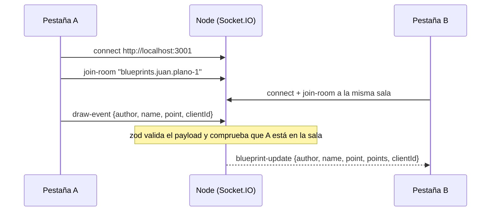

**Servidor — validación y salas** (`back-rt-socketio/server.js`, extracto):

```js
const PART = /^[A-Za-z0-9._\- ]{1,64}$/
const drawSchema = z.object({
  author: z.string().trim().regex(PART),
  name: z.string().trim().regex(PART),
  point: z.object({
    x: z.number().int().min(0).max(520),
    y: z.number().int().min(0).max(360),
  }),
  clientId: z.string().regex(/^[A-Za-z0-9-]{1,64}$/).optional(),
})

io.on('connection', (socket) => {
  socket.on('join-room', (room) => {
    const parsed = roomSchema.safeParse(room)
    if (!parsed.success) return socket.emit('rt-error', { event: 'join-room', error: 'invalid room' })
    leaveCurrentRoom()                    // una pestaña colabora en un solo plano a la vez
    socket.join(parsed.data)
    socket.data.room = parsed.data
  })

  socket.on('draw-event', (payload) => {
    const parsed = drawSchema.safeParse(payload)
    if (!parsed.success) return socket.emit('rt-error', { event: 'draw-event', error: '…' })

    const { author, name, point, clientId } = parsed.data
    const room = roomFor(author, name)    // la sala se deriva de los datos validados
    if (socket.data.room !== room) {
      return socket.emit('rt-error', { event: 'draw-event', error: 'join the room first' })
    }
    // socket.to(room) excluye al emisor
    socket.to(room).emit('blueprint-update', { author, name, point, points: [point], clientId })
  })
})
```

`blueprint-update` incluye `points: [point]` además de `point` para ser compatible con el formato
del [repo guía](https://github.com/DECSIS-ECI/example-backend-socketio-node-).

**Cliente** (`front/src/services/socketService.js`, extracto):

```js
socket = io(base, { transports: ['websocket'] })   // VITE_IO_BASE

// join-room dentro de connect: se repite en cada reconexión,
// porque el servidor olvida las salas al caer el socket.
socket.on('connect', () => {
  socket.emit('join-room', `blueprints.${room.author}.${room.name}`)
  onStatus?.({ state: 'connected' })
})

socket.on('connect_error', (err) =>
  onStatus?.({ state: 'error', detail: `No se pudo conectar a ${base} (${err.message})` }),
)

socket.on('blueprint-update', (payload) => {
  const points = payload?.points ?? (payload?.point ? [payload.point] : [])
  for (const point of points) onUpdate?.({ ...payload, point })
})

// Enviar un punto
socket.emit('draw-event', { room, author, name, point, clientId })
```

### 5.5 Diseño del cliente

| Archivo (`front/src/`) | Responsabilidad |
|---|---|
| `services/stompService.js` | Cliente STOMP: reconexión cada 3 s, heartbeat de 10 s, suscripción en `onConnect` |
| `services/socketService.js` | Cliente Socket.IO: transporte WebSocket forzado, `join-room` en cada `connect` |
| `features/realtime/realtimeClients.js` | Lista del selector, fábrica común e identificador de pestaña (`CLIENT_ID`) |
| `features/realtime/realtimeSlice.js` | Estado de Redux: tecnología elegida, estado de la conexión y error |
| `hooks/useRealtime.js` | Crea el cliente al cambiar de tecnología o de plano, despacha los puntos remotos y limpia al desmontar |

Los dos servicios exponen la misma interfaz —`connect(room)`, `sendPoint(payload)`,
`disconnect()`—, de modo que agregar un tercer transporte es escribir una función más y
registrarla en la fábrica. `BlueprintCanvas.jsx` no cambió respecto a la Parte 3: los puntos
remotos entran al mismo arreglo de Redux que los locales.

### 5.6 Decisiones de diseño

- **Un plano = un tópico/sala.** El aislamiento lo da el broker: dos pestañas en planos distintos
  nunca se ven, sin filtrar nada en el cliente.
- **Suscripción dentro del callback de conexión.** Suscribirse o hacer `join-room` antes del
  handshake se descarta en silencio; por eso ambos clientes lo hacen en `onConnect` / `connect`, lo
  que además re-suscribe automáticamente tras una reconexión.
- **Eco propio por `clientId`.** Cada pestaña genera un identificador y lo envía con el punto; al
  recibir un mensaje con su propio `clientId` lo ignora. Así un punto de otra pestaña con
  coordenadas repetidas (por ejemplo, al cerrar una figura) no se pierde. Si el servidor no reenvía
  `clientId` (como el del repo guía), el reducer deduplica por coordenadas.
- **Guardar es un reemplazo, no un append.** En tiempo real todas las pestañas tienen los mismos
  puntos sin guardar; con un `PUT` por punto, cada pestaña que pulsara *Guardar Cambios* los
  duplicaría en la base de datos. El `PUT /api/blueprints/{author}/{name}` es idempotente.
- **Los puntos de tiempo real no se persisten solos.** El broadcast es efímero y la persistencia es
  explícita (botón *Guardar Cambios*): no hay una escritura en base de datos por cada clic.
- **Un cliente descartado no pisa el estado.** Al cambiar de plano, el cliente anterior notifica su
  cierre de forma asíncrona; `useRealtime` ignora los eventos de clientes ya reemplazados para que
  el badge no quede en `disconnected` estando conectado.
- **La sala la decide el servidor (Socket.IO).** Se deriva del autor y el nombre ya validados, no
  del campo `room` que envía el cliente, y solo puede dibujar quien hizo `join-room` a esa sala.

---

## 6. Seguridad

- **JWT con scopes en todo el CRUD.** El back firma los tokens con RSA y exige
  `blueprints.read` / `blueprints.write` por endpoint. El front adjunta el token con un interceptor
  de Axios y cierra la sesión ante un `401`.
- **Validación de payloads en el servidor.**
  - *STOMP:* autor y nombre contra `[A-Za-z0-9._- ]{1,64}` (se interpolan en el destino del broker)
    y punto dentro del lienzo `520×360`.
  - *Socket.IO:* los mismos límites, declarados con **zod**; los mensajes inválidos se rechazan con
    `rt-error`.
- **Orígenes restringidos.** `blueprints.realtime.allowed-origins` (handshake STOMP y CORS del API)
  y `ALLOWED_ORIGINS` (Socket.IO); por defecto solo `http://localhost:5173`.
- **Limitación conocida:** los canales de tiempo real no validan el JWT. El handshake STOMP está en
  `permitAll` y el servidor Socket.IO no pide token, de modo que quien alcance esos puertos
  puede publicar puntos efímeros. No puede persistirlos: guardar exige JWT.
  Para producción haría falta un `ChannelInterceptor` que valide el token en el `CONNECT` de STOMP
  y un middleware `io.use` en Socket.IO.

---

## 7. Observabilidad y estabilidad

| Componente | Qué registra o expone |
|---|---|
| Back (STOMP) | Conexión, suscripción y desconexión de cada sesión (`RealtimeSessionLogger`); cada punto dibujado; cada mensaje rechazado con su motivo (`RealtimeExceptionHandler`) |
| Back (health) | `GET /actuator/health` |
| Socket.IO | Conexión con su origen, `join` / `leave`, puntos y rechazos; `GET /health` devuelve estado, uptime, clientes conectados y salas activas |
| Front | Badge junto al selector (`connected` / `disconnected` / `error`), mensaje con el detalle del error y trazas `[rt:stomp]` / `[rt:socketio]` en la consola |

**Reconexión**, probada tumbando cada servidor con una pestaña abierta:

- *Socket.IO:* el badge pasa a `error` con el detalle; al volver el servidor, el cliente reconecta
  solo (backoff exponencial propio) y se vuelve a unir a la sala.
- *STOMP:* el badge pasa a `disconnected`; `@stomp/stompjs` reintenta cada 3 s (`reconnectDelay`) y
  se re-suscribe al tópico en `onConnect`.
- *Hallazgo:* el back genera las llaves RSA del JWT en cada arranque, así que tras reiniciarlo el
  canal STOMP se recupera solo, pero el token REST deja de servir (la siguiente llamada da `401` y
  el front cierra la sesión). Los puntos dibujados mientras el servidor estuvo caído no se
  retransmiten: quedan locales hasta guardar.

Las capturas de los logs y de los health checks están en la sección [Evidencias](#10-evidencias).

---

## 8. Análisis: Socket.IO vs STOMP

Se implementaron y probaron **ambos**. Mediciones en local (dos clientes en el mismo plano, 280
puntos tras calentamiento, tiempo desde que A publica hasta que B recibe):

| Transporte | Mediana | p95     | Máximo   |
|------------|---------|---------|----------|
| STOMP      | 3.7 ms  | 7.0 ms  | 12.4 ms  |
| Socket.IO  | 1.5 ms  | 2.4 ms  | 8.6 ms   |

Ambos son imperceptibles para dibujar a mano. La diferencia viene de que el mensaje STOMP pasa por
el controlador, la validación y el broker simple de Spring, mientras que Socket.IO reenvía dentro
del mismo proceso. En `localhost` no hay latencia de red, así que estos números miden el costo del
servidor, no el de un despliegue real.

| Criterio              | Socket.IO (Node)                                   | STOMP (Spring Boot)                                   |
|-----------------------|----------------------------------------------------|-------------------------------------------------------|
| Servicios a operar    | Uno adicional (proceso Node)                       | Ninguno: vive en el mismo back                        |
| Código de servidor    | Un archivo de ~100 líneas, API muy directa         | 3 clases y la configuración del broker                |
| Protocolo             | Propio sobre WebSocket: solo clientes Socket.IO    | Estándar: cualquier cliente STOMP, en cualquier lenguaje |
| Salas / tópicos       | Rooms por socket; el servidor decide quién entra   | Suscripciones del broker; el cliente elige el destino |
| Eco al emisor         | Se evita con `socket.to(room)`                     | Hay que filtrarlo en el cliente                       |
| Reconexión            | Automática, con backoff exponencial de serie       | Reintento fijo configurable                           |
| Autenticación         | Hay que implementarla (middleware)                 | Se integra con Spring Security (interceptor)          |
| Escalado horizontal   | Requiere adapter (Redis) para compartir salas      | Requiere broker externo (RabbitMQ / ActiveMQ)         |
| Latencia medida       | Menor                                              | Algo mayor, igualmente despreciable                   |

**Conclusión.** Para este proyecto se eligió **STOMP** como transporte principal: el back ya es
Spring Boot, no añade un proceso que desplegar y monitorear, y el protocolo es estándar. Socket.IO
resultó más rápido de escribir y trae mejor reconexión de serie; sería la opción natural si el back
fuera Node o si la prioridad fuera la ergonomía del canal sobre la interoperabilidad.

---

## 9. Pruebas

| Carpeta             | Comando                                       | Resultado                   |
|---------------------|-----------------------------------------------|-----------------------------|
| `front/`            | `npm test` · `npm run lint` · `npm run build` | 66 pruebas en 7 archivos    |
| `back/`             | `mvn test`                                    | 4 pruebas                   |
| `back-rt-socketio/` | `npm test`                                    | 5 pruebas                   |

- **Front** (Vitest + Testing Library): reducers, servicios (mock y Axios), construcción de la URL
  del broker, manejo del eco y componentes.
- **Back** (JUnit): validación y enrutamiento por tópico del controlador STOMP.
- **Socket.IO** (`node --test`): levantan el servidor real en un puerto libre y conectan clientes:
  replicación, aislamiento entre salas, rechazo de payloads inválidos y health check.

Ninguna suite necesita la base de datos ni los servidores levantados.

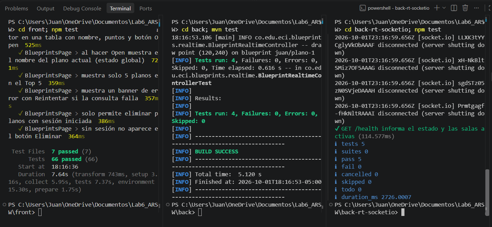

---

## 10. Evidencias

El recorrido completo está en el **[video de demostración](https://youtu.be/-SgkN_35QZ0)**.

### Colaboración en vivo

Dos ventanas sobre `juan/plano-1` con STOMP: mismo trazo, mismo contador de puntos y badge
`connected` en ambas.

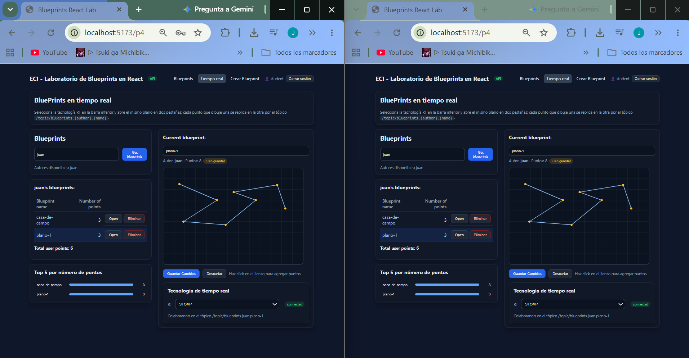

### Estado inicial

Con el selector en **None**, el lienzo carga los puntos guardados del plano y el total del autor.

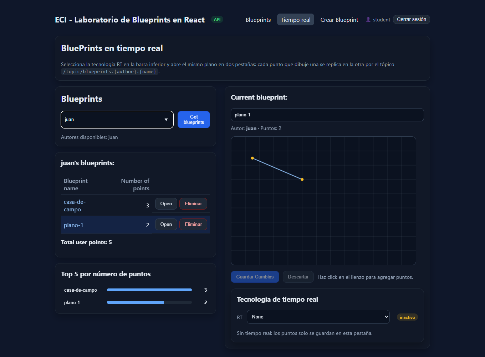

### Aislamiento por plano

Una pestaña en `plano-1` recibe los puntos; otra en `casa-de-campo`, conectada al mismo servidor,
no recibe nada. El comportamiento es el mismo con los dos transportes.

| Transporte | Pestaña en `plano-1` | Pestaña en `casa-de-campo` |
|------------|----------------------|----------------------------|
| STOMP      | 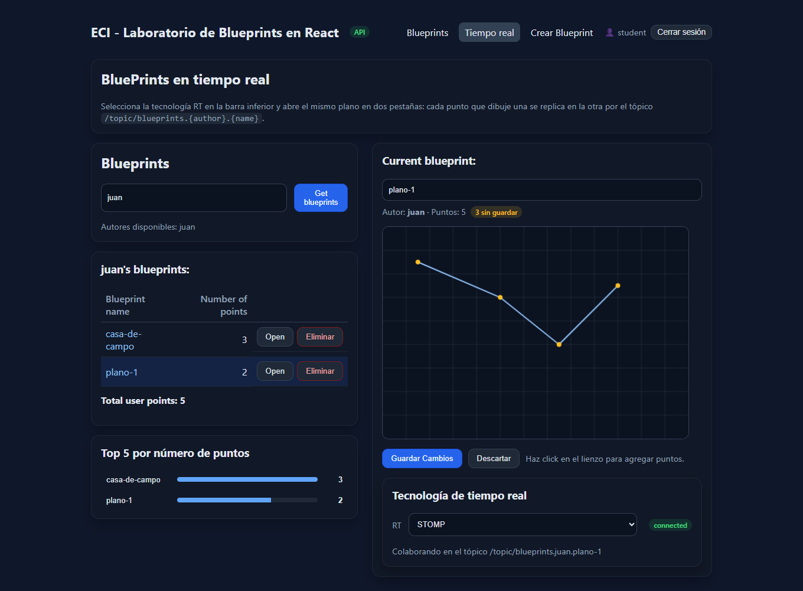 | 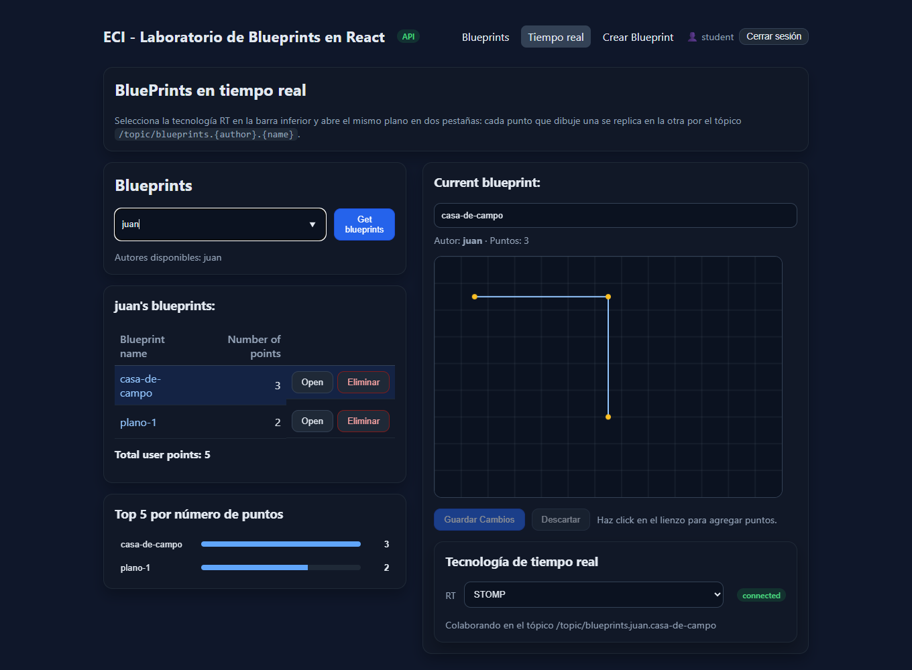 |
| Socket.IO  |  |  |

### CRUD

Crear un plano lo agrega a la tabla y sube el total; eliminarlo lo quita y lo vuelve a bajar.

| Create | Tabla y Total tras crear | Tabla y Total tras eliminar |
|--------|--------------------------|-----------------------------|
| 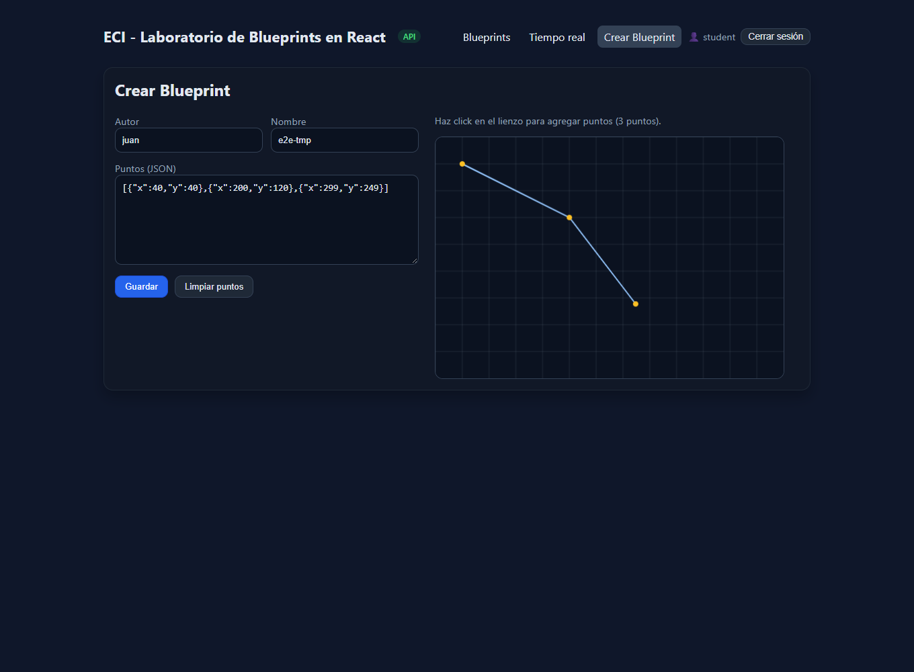 | 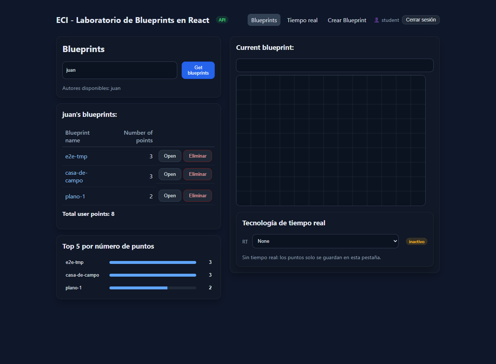 | 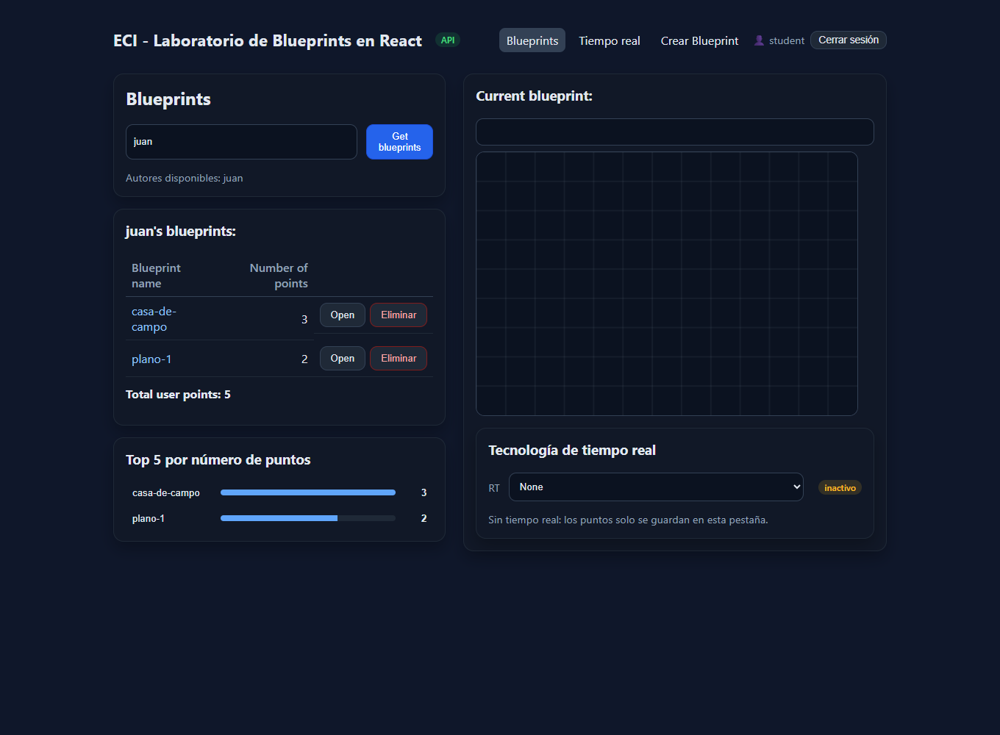 |

### Observabilidad

Logs del back con STOMP: sesiones conectadas, suscripción al tópico del plano y cada punto
dibujado.

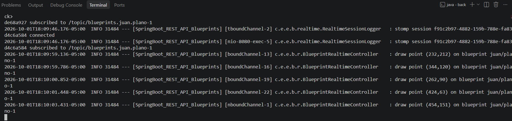

Logs del servidor Socket.IO: conexión con su origen, entrada a la sala y cada punto.

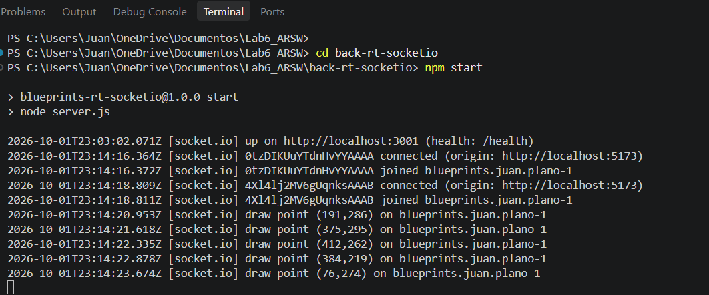

Health checks: el del servidor Socket.IO informa dos clientes en la sala `blueprints.juan.plano-1`.

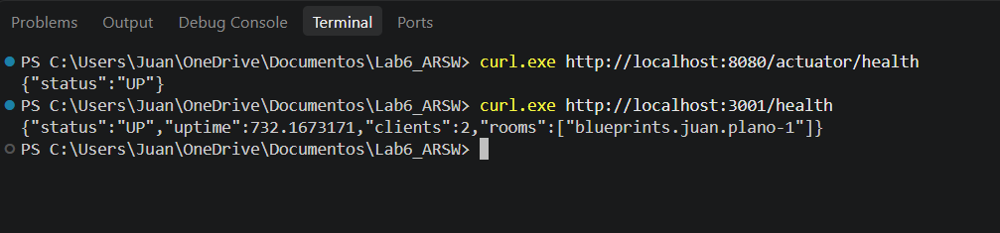

### Manejo de errores

Con el servidor de tiempo real caído, el badge pasa a `error` y se muestra el detalle.

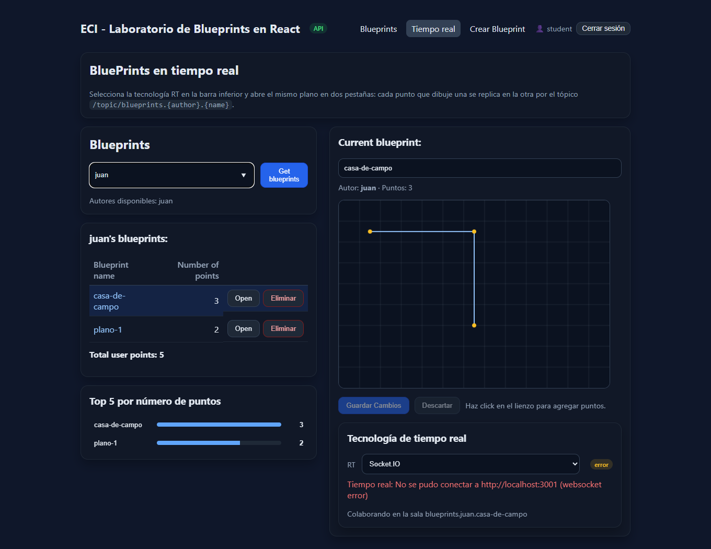

### Seguridad

El API rechaza con `401` una petición sin token.

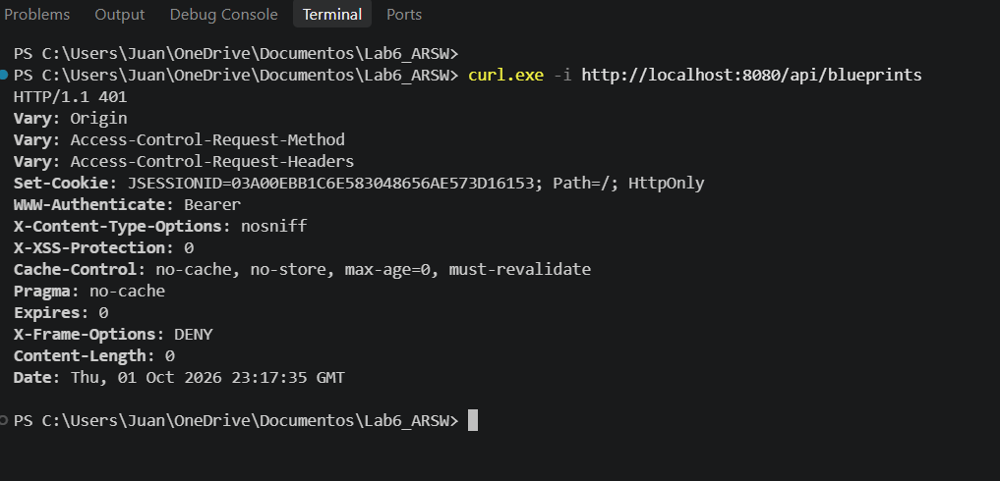

---

## 11. Documentos relacionados

- [COMO_EJECUTAR.md](./COMO_EJECUTAR.md) — guía operativa para Linux y Windows, y troubleshooting.
- [back-rt-socketio/README.md](./back-rt-socketio/README.md) — contrato y validación del servidor Socket.IO.
- [front/README_P4.md](./front/README_P4.md) — archivos que añade la Parte 4 en el front.
- [front/README.md](./front/README.md) y [front/SOLUCION_LABORATORIO.md](./front/SOLUCION_LABORATORIO.md) — Parte 3 (Redux + Axios + JWT).

## Licencia

MIT.
